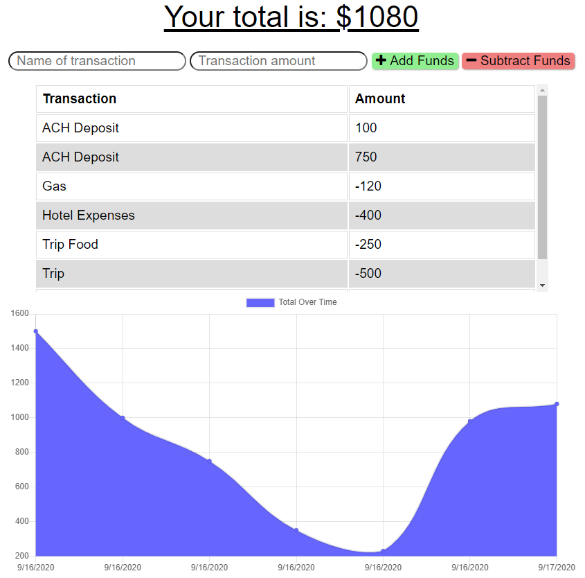

# Budget Tracker    

## Description 
 
This budget tracker is a Node.js that works online and offline with service-worker and will allow the user to keep track of expenses and deposits while being online, and when losing connection, the user will continue to be able to post transactions that will be added to the database once the page goes back online.

## Table of Contents 

* [Usage](#usage-information) 

* [Installation](#installation-instructions) 

* [License](#license) 

* [Where to Contribute](#where-to-contribute) 

* [Tests](#tests) 

* [Repository](#repository) 

* [URL](#url) 

* [Questions](#questions) 

* [Screenshots](#screenshots) 

## Usage Information 
 
    Designed having travelers in mind, this app will allow tracking of withdrawals and deposits whether data internet connection is available or not, allowing the account balance to stay accurate when traveling.  

## Installation Instructions 
 
    npm i  

## License 
 
This application is covered under this license: MIT

    
## Where to Contribute 
 
Contributions are possible through the GitHub account below. 

## Tests 
 
npm test  

## Repository 
 
This repository is hosted in GitHub and you may access it at [https://github.com/johnsbrook/15_Budget_Tracker_Online_Offline](https://github.com/johnsbrook/15_Budget_Tracker_Online_Offline). 

## URL 
 
[Budget Tracker](https://budget-tracker-ijz.herokuapp.com/) 

## Questions 
 
GitHub: [johnsbrook](https://github.com/johnsbrook) 
 
Email: [ivan.zapata.rivera@gmail.com](mailto:ivan.zapata.rivera@gmail.com)

## Screenshot 
 
 
 
